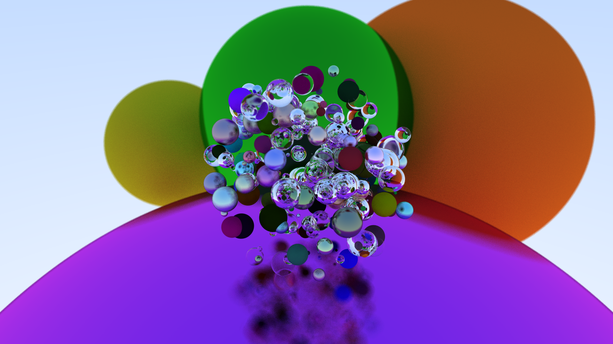
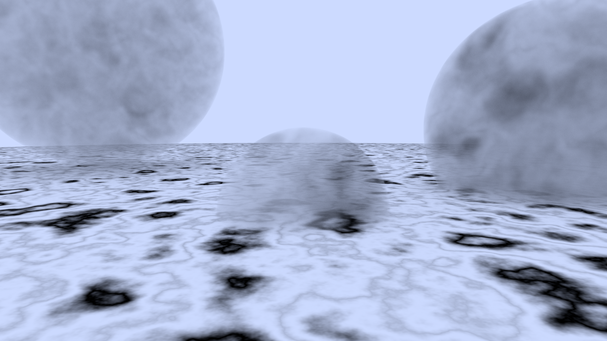
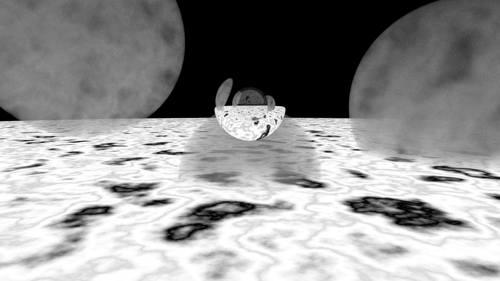
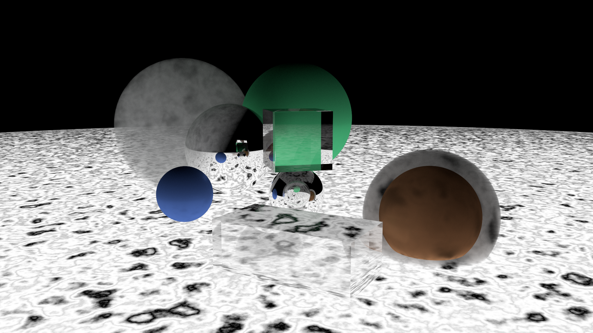
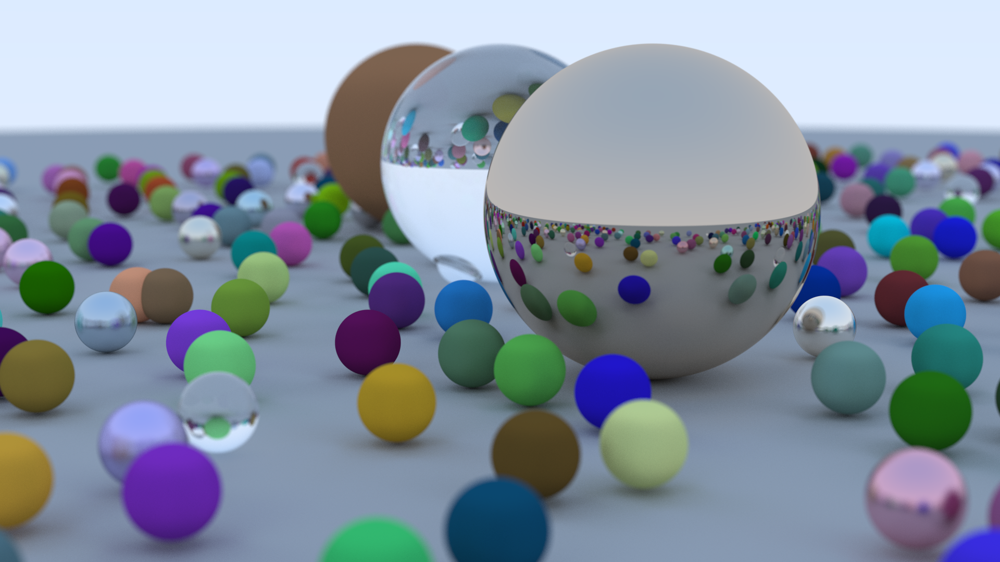
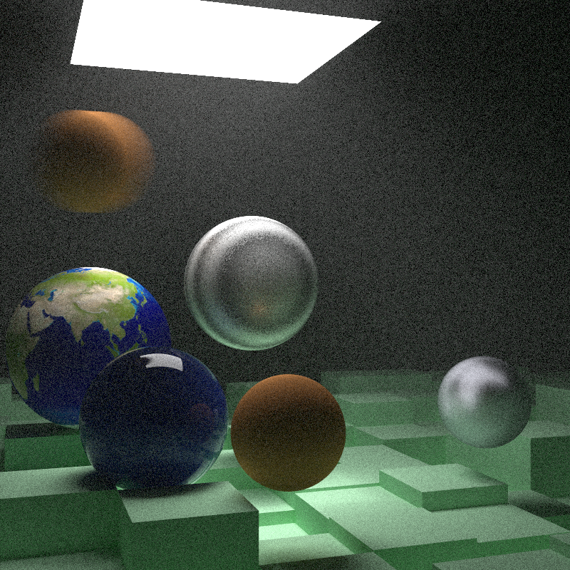
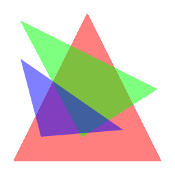
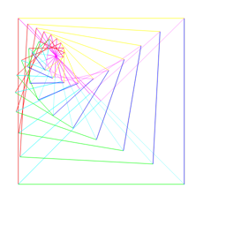

# Rusterizer

A Software Rasterizer and Path Tracer written in Rust

### <u>My code implements these papers and books:</u>
- Algorithm for computer control of a digital plotter - J. E. Bresenham
- An Efficient Antialiasing Technique - Xiaolin Wu
- [Ray Tracing in One Weekend](https://raytracing.github.io/books/RayTracingInOneWeekend.html)
- [Ray Tracing: The Next Week](https://raytracing.github.io/books/RayTracingTheNextWeek.html)

### Supported Features:

- Line, Triangle, & Point rasterization
- Ray-Sphere, Ray-Quad, Ray-Plane intersection
- Diffuse, Reflective, Refractive & Emissive materials
- Monte Carlo-based sampling
- Bounding Volume Hierarchies (BVH)
- Volume Rendering
- Direct Illumination
- Global Illumination
- Texture Loading
- Procedural Noise Textures

### Usage Guide:

This project is for learning, so scene generation is entire procedural (hard-coded).

To use this code yourself, clone the repository, open the folder in your favorite Rust IDE, and click run. I used RustRover.

See `main.rs` for the code that generated these scenes below:

### Path Tracing:

 

 

 

 

 

 

### Rasterization:

